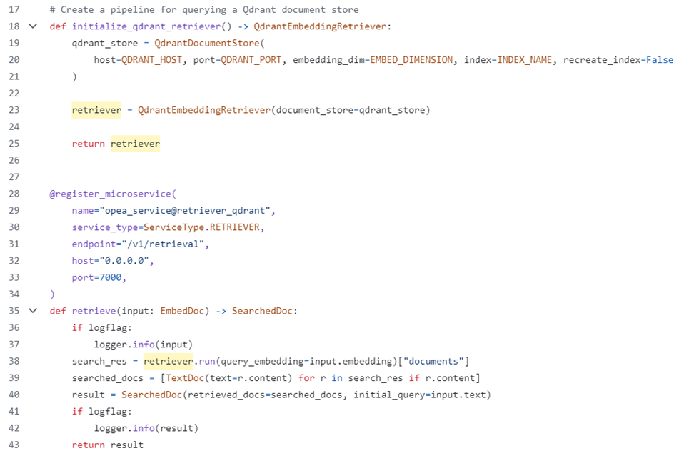

# Proposal for Database Interface Definition in Retreival and Data-Prep

## Author(s)

Wang Xigui (xigui.wang@intel.com), Hu Ying (ying.hu@intel.com)

## Status

## Abstract:

We have identified several issues in the GenAIComps retrieval and data preparation implementations. The problems are as follows:

1. There is duplicated and unaligned code in the retrieval and data preparation microservices. This is duo to the retrieval implementation integrating and adapting to different databases (Redis, Milvus, Pgvector, etc.) and different frameworks (LangChain, LlamaIndex, Haystack).
2. There are inconsistent implementation of software stack layer: most of the retrieval mirocs-service instances are implemented through database layer while Qdrant is implemented through retrieval layer.

Scalable and Seamless integration are two advantanges of OPEA. These issues weaken the scalability and seamlessness of OPEA.
We propose defining a clear software stack layer and a clear interface for the database to solve these problems.

## Objective

1. Remove duplicated code in retrieval and data-prep micro-service.
 * consolidates the 11 retireval micro-service into a single version.
 * consolidates the 12 data-prep micro-service into a single version.
2. Ensure a consistent software stack layer in retrieval/data-prep micro-service.
 * Define clear retrieval and database software stack layers.
 * Define a clear interface for the database.

## Motivation

1. Maintaining duplicated code is challenging and often results in inconsistent implementations. This weakens the scalability and seamless integration of the retrieval and data-prep components.

2. An inconsistent software stack layer mixes retrieval and database in one module. It's the retrieval level that reorganize the data, which is beyond the database scope. To bring advanced retrieval feature (GraphRAG etc.) into OPEA easily, it is helpful to decouple retrieval and database.

## Design Proposal
### Define Clear Database Inerface
1. GenAIComps retrieval is built on top of LangChain, LlamaIndex, Haystack, etc. It registers a retrieval microservice for each database integrated in a certain framework, as shown in Figure 1.

Figure 1.  Current Structure: retrieval interacts with different DB

Micro-service are implemented in bottom layer, with a total of 11 versions of retrieval code for different DBs and framworks. For example, Redis@langchain, Redis@LlamaIndex and Qdrant@Haystack, etc.
Additionally, these retrieval code are **NOT** always aligned.

The databse interface is key to simplify the database integration into retrieval (and data-prep).
To make retrieval easy to adapt to different database, a database interface is proposed. The database interface act as:
a. A clear interface to adapt different DB
b. Simplifying database integration in OPEA
    * Databases don’t interact with micro service
    * Databases aren’t aware of retrieve and data preparation
c. Providing a standard and clear scope for intergration unit test and verification

With the database interface, the new retrieval structure is shown in Figure 2.

Figure 2. Propose Structure: Retrieval adapts to diffrent database throught DB interface

#### New Interface for DB

We have implemented the proposed prototype, as shown in Figure 3. Only a single retrieval micro-service code is needed.

Figure 3.  Retrieval Interacts with OPEA Database

Please be noted the interface shown is just a prototype.
The interface must be defined carefully:
1. It must cover the current functionality. 
    No functionality change after implementation with with new inferace.
2. Extension of new feature and functionality should be considered.
3. Take care of interface version management.
    Strategy: the compatbility of versions;
4. More: ...

### Proposal 2: Separated Retrieval and Database Layer in Framework
#### Current implementation mixes retrieval and database layer
There are 11 versions of retrieval code. Most of them interact with database layer interfaces to implement the retreival task. However, Qdrant based on haystack implements retrieval through retrieval layer interface.
Interestingly, Qdrant data-prep micro-service interacts with database interface, as shown in Figure 4.
Both retrieval and database layer are not used in the implementation.

 
Figure 4 a) retrieval micro-service based on Qdrant interfact with retrieval interface

Figure 4 b) retreival micro-service based on Redis interact with Database interface

Figure 4 c) data prepare micro-service interact with Database interface

#### Proposal: Clear Declaration of Retrieval Layer

Data-prep and retrieval are paired actions, because pata-prep write data into DB and retrieval read data from DB.
The data organization and structure building (in data preparation) decide how we use them in retrieval.

It's the retrieval level that reorganizes the data and build the structure, which is beyonds the database scope. For the complicated retrieval case, such as Graph RAG, the retrieval is heavy. A retreival layer is helpful to enable the retrieval algorithm to different database.

#### Define Clear Retreival Interface

To integrate LangChain, LlamaIndex, and Haystack retrieval into OPEA, we face the same problems of DB integration. 

A retrieval interface is necessary to bring third party advanced retreival RAG int OPEA.

The current implementation of retrieval are simple RAG.
1. Only texts are processed.
   * No image and Table, video and audio etc, are not processed.
2. Simple retrieval to split text into chunks. Retrival are the text chunks.
   * Advanced retrieval is not implemented yet.

So, it is not ready yet to define the retrieval interface now. Some more investigation is needed.

## Alternatives Considered

## Compatibility

For the interfaces definition, the compatbility of each version is important.

## Miscellaneous

The implementation prototype just takes retreival as examples. Rata-prep and retrieval benefit from the database interface.

For database interface definition, an both data-prep and retrieval are taken into consideration at the same time, it's a unified interface for data-prep and retrieval.

