## Problem Statement
### Duplicated Code and Unalignment Code

GenAIComps retrieve component implements the retrival function based on vecotr database.
To integrate different Database (Redis, Milus, Pgvector, etc) and different frameworks (langchain, llama_index, haystack) into OPEA, current solution is by implementation different instances to interact with DBs. This brings repeaded retrieval micro-service code (Figure 1). It's consumes huge efforts to maintain such code, and more worse, the it's easy to leads to unliagned retrieval code because some of them are NOT updated. Till now, there are 11 duplicated retrieval micro-service code (Figure 2).

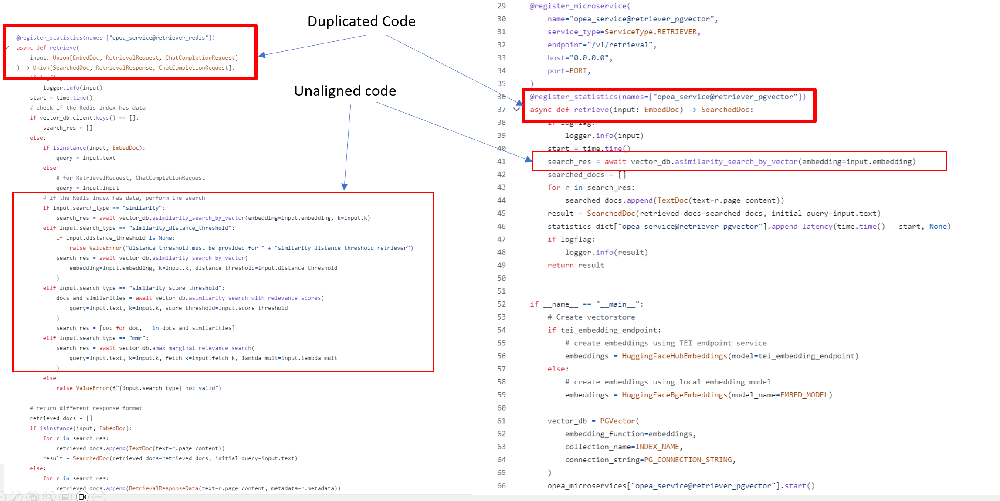

Figure 1 Duplicated and unaligned code 

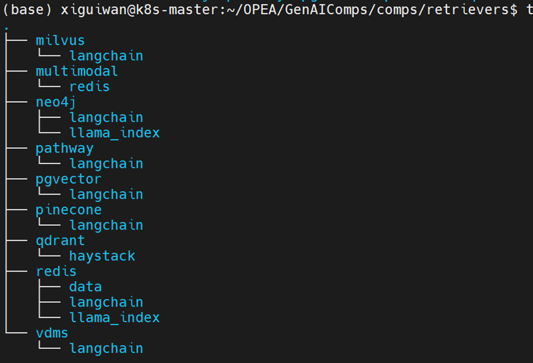

Figure 2 There are 11 duplicated retrieve micro-service code

GenAIComps data-prep components are of the same cases. In fact, data preparation and retrieval are paired actions. Data-pre write the data into database, retrivel (search and ) read data from the database.
There are 12 duplicated data-prep micro-services code Figure 3.

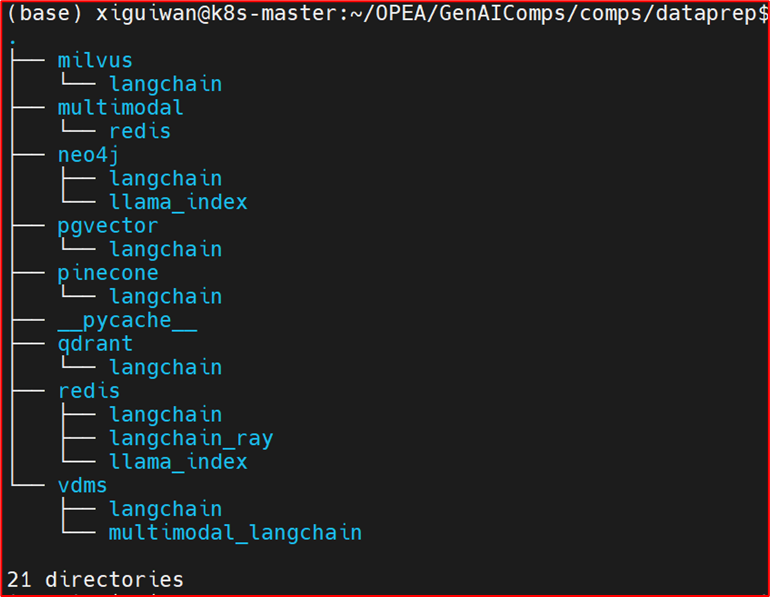

Figure 3. There are 12 duplicated data-prep micro-service code

### Inconsistent implementation of Software Stack/Layer

For most of the implementation in data-prep micro-service and retrieval micros-service, both interact with Data-base. Data preparation write data into database, and retrieval data from the data-base.

However, Qdrant implementation are quite different. Qdrant based retrieval micro-service interacts with haystack retrieval (interface) but qdrat data-prep micro-service interacts with data-base interface, Figure 3.

We just point out inconsistent implementation here. In next section we will discuss the database and retieval interface.

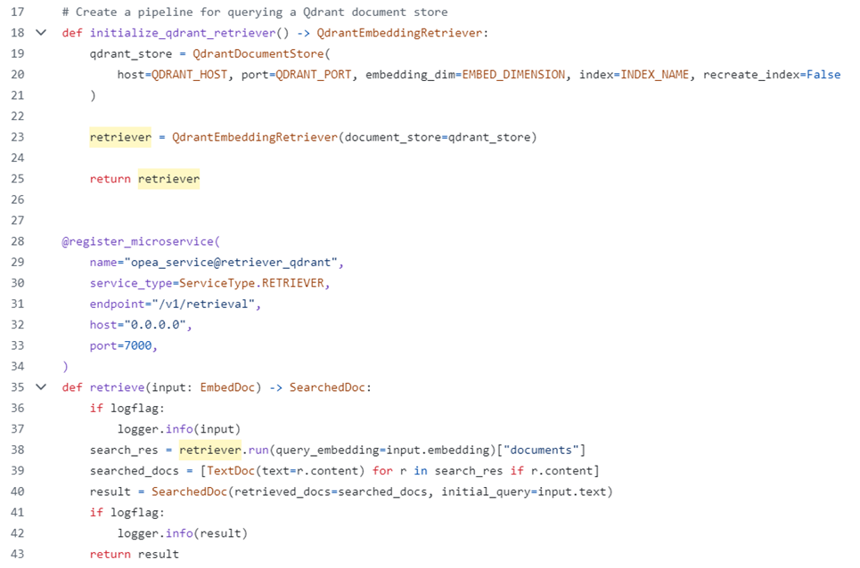 
Figure 4 a) retrieval micro-service based on Qdrant interfact with retrieval interface

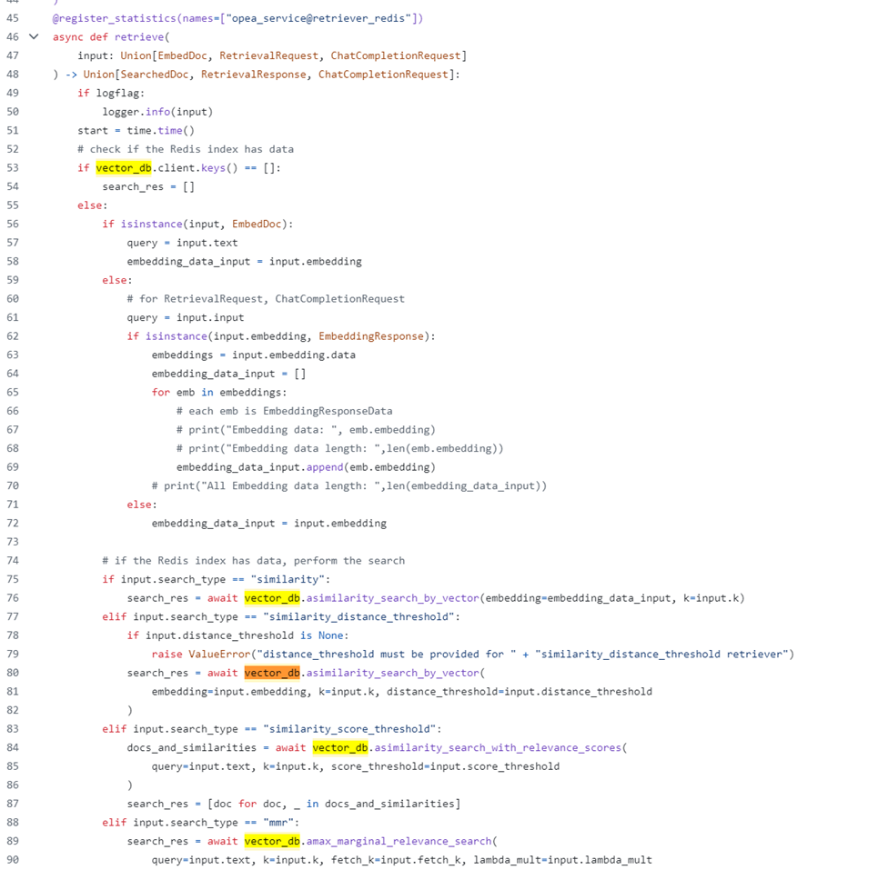
Figure 4 b) retreival micro-service based on Redis interact with Database interface

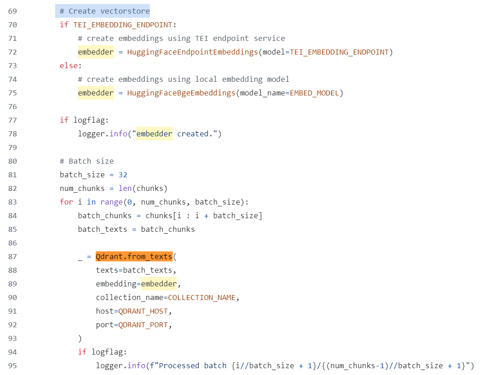
Figure 4 c) data prepare micro-service interact with Database interface

## Problem Analysis 

In this section, we analysis some of the reasons that lead to current poblems. And dicsuss the way to solve it.

### Why Duplicated Code 
When we want to intergrate a new database into OPEA, look through the code, there is no clear interface to connect a DB into OPEA. So the easy way implemenation is to copy those components (retrieval and data-prep in this case) interact with database, replacie the db interface with the one to be integrated.

This intergration is not easy actually, as the micro-servcie are involved during the process. That's make things complicated as for DB they interface with read/write of DB actually. We cannot intergrate third party component seamless.

And it's hard to maintain these duplicated code, and we observed there are unaligned code of retrieval. This hurt the scalability of OPEA.

### Retrieval and Database 

framework diagram
current status and proposal final result

The GenAIComp retrieval implementaont in OPEA are not inconsistent yet: Most of them are based on DB while Qdrant are based retrieval.
In the GenAIComp for example [Redis](https://github.com/opea-project/GenAIComps/blob/9d6d7b8195f3f456bc6d3deff5dcc9805f2f8a31/comps/retrievers/redis/langchain/retriever_redis.py#L76) implement retrieval through DB interfaces directly, however, [retrieval basedon Haystack/Qdrant implementation](https://github.com/opea-project/GenAIComps/blob/9d6d7b8195f3f456bc6d3deff5dcc9805f2f8a31/comps/retrievers/qdrant/haystack/retriever_qdrant.py#L38), implemente through HayStack retrieval interface.

It seemed that there is no clear software stack layer about retrieval and DB, both are used in retrieval components alternatively.

Though DB defines the interface to seach the relevant data, it does not mean DB can replace retrieval layer. 
The most imporntants things for retrieval is to **reorganize** data so that we can **efficently** use them. 

*LLM* limitation in naive RAG and GraphRAG improve the accuraty, GraphRAG is far out the scope of DB, it is retreval to implement this function.

### Is Clear Software Stack Necessary

Once we take retreival and database as two diffrent layers. The next question is do we need a clear software stack (at east for these two) in OEPA?

The answer is Yes. 
Currently we implement the simple text retrival, without images, tables being processed. So retrieval component interact with DB interface. As advanced retrieval feature (i.e, GraphRAG) and more media data (image/video, audo etc) being supported, the DB output result could be strucutred data. In this cased, a special retrieval layer is a good choice to implement these functions in OPEA.

Combination of retrieval and database make the components complicated and weak the module functions. Data-pre preprations reorganize the data first, then write the data into database. That are two different stages. 
The way how we index the data decide how we explain the DB retried data result (e.g. are the retrival result the summary of text, or the origanl chunck of text etc.).

## Our Proposal for OPEA

### Clear Software Stack Layer

We propose definiton clear software stack layer for Retrieval and database.

Spearate retrival layer from database layer. 
So that GraphRAG and other advanced retrival feature could be separated from DB layer, and when the retrieval feature are enabled, it's possible to reuse/enable the retrieval feature adapt to diffrent DB.

When retrieval and DB layer are clear claimed, we can avoid the inconsistent layer implementation in the retrieval component.

Actually, not only retreival and database layers, whenever possible, the othere layers in OPEA framework could be considered claim clearly.

### Clear Interface 

We propose definiton clear API interface for the common core components, such as retrieval and database.

With the clear interface for the compnents, it's easy to intergrate third party module into OPEA component. The integratoin work focuses on the interfaces, without involving other OPEA frameworks.
For example, intergate DB into retrieval only implement database related interfaces, it does not require much knowledge about data-prep or retrieval. It's completely independent of micro-service, so won't have the duplicated code in that case.
Without the interfaces, we are opt to integrate the DB into data-prep and retrieval components, and that creates the duplicated code.

Given the DB interface:
1. It's quit normal to define a unified interface for DB read/query and write interfaces. And the data process in data-prep and retrieval could be eaily paired.
2. We have a standard as well as clear scope of the intergration work. It give the conformance to build the unit test as well as verfication of the intergration.

### Experiment and Result

Currently, the retrieval and the database component exposed the duplicated and unaligned code as well as inconsisten implementation of layer problems.

We'll have a experiment to show how our proposal solve this problems. 

### Experiment of DB interface

We experiment the database interface prototype based on current retrieval implementation.

1. definition of DB interfaces in retrieval components
**NOTE** This is just a experiment (to remove duplicated retrieval code). A unified DB interfaces (for retreival and data-prep) of the formal DB interfaces need to be discussed and defined carefully.

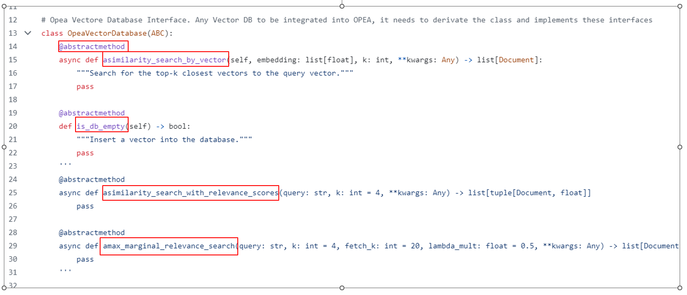

Figure 5. Database inteface in retrieval component 

2. Integrate DB into retrieval given the DB interface

To integrate a new DB into OPEA. It requires to derivates the DB interface class, implement the required abstract intefaces in intefaces class. 

The integration of DB is simplifed. You can intergrate DB into OPEA without anything about micros-services. In another words, the retreival code change does not affect the DB integration. enve if you don't know retrieval, data-prep, you still can do this integration.

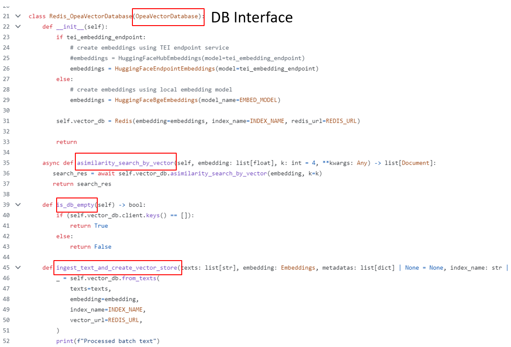

Figure 6. Implment the required Interface to integrate a database into OPEA

3. Retrieval interact with DB interface class and API

Retrieval and data-prep component don't have to adapt different database any more. They interfact with DB interface class and API, instead. That's enough. 

Implemenation of retreival is in Figure 5 and Figure 6. Here we have only one retrieval micro-service code. it consolidates the 11 retireval micro-service into one single instance, Figure 8.

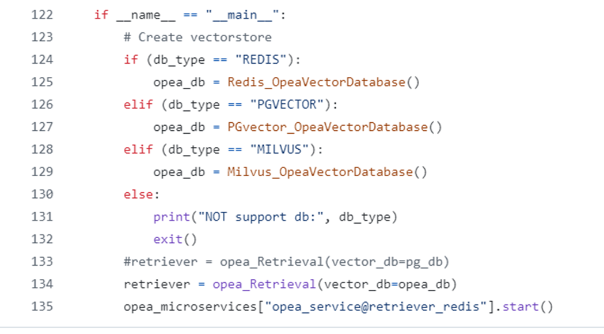

Figure 7. Implment the required Interface to integrate a database into OPEA

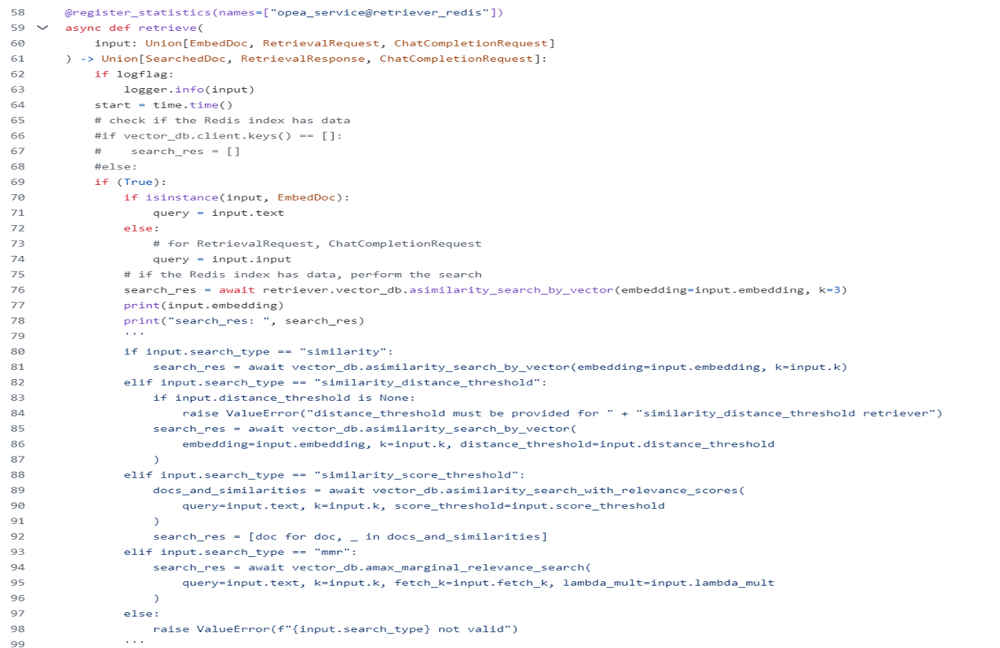

Figure 8. Implment the required Interface to integrate a database into OPEA

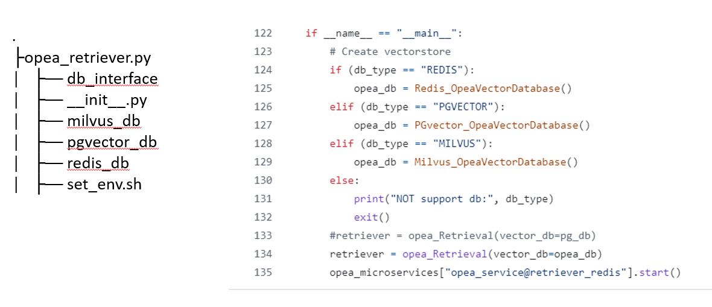

Figure 9. retrieval component structure with DB interfaces

###

## Conclusion
